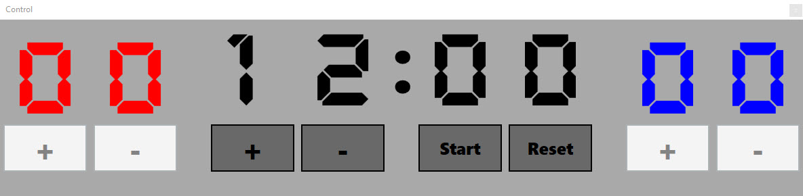
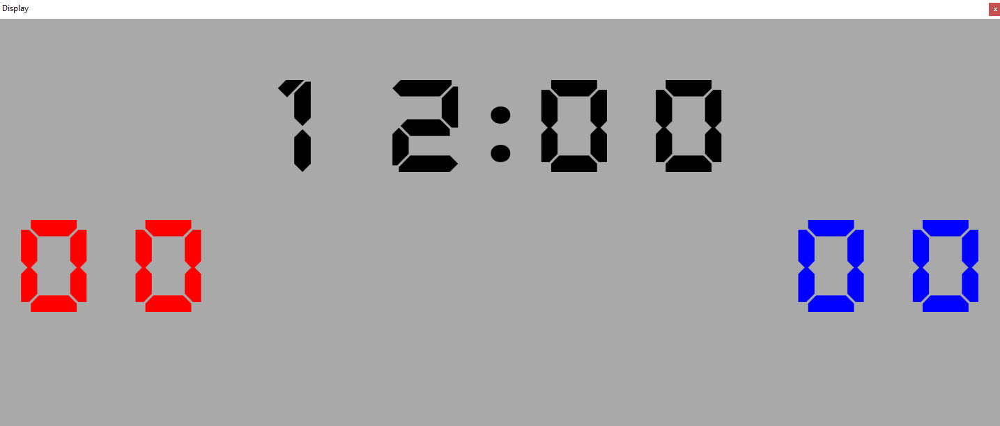

# Simple Scoreboard

This is a simple and easy to use Scoreboard with Game Timer and Score counter.

## - ⚡ Important:
install the "Ni7seg.ttf" font which is contained in the repo folder!! (simply right-click the file and select install)
## Control Window:

You can set the Gametime, Start/Pause/Reset the Game and count the Scores. 

## Display Window:

Drag the Window to a second Monitor and maximize it.

